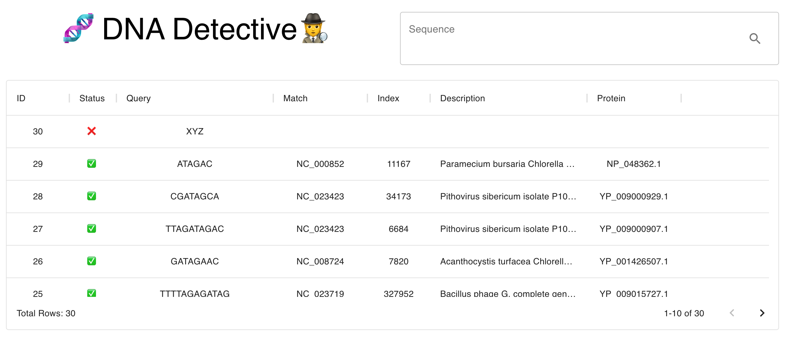

## DNA Detective

### Overview
DNA Detective investigates GenBank files and follows clues through feature metadata to identify protein suspects asynchronously. 

The tool supports user inputs of up to 2000 bases and stores the results of previous searches for review. The matching process happens asynchronously and results update the interface as they become available. Because the first located protein is returned and the proteins are searched in a randomized order, results may vary for the same query across searches. If a sequence spans multiple proteins, the protein that contains the start of the sequence is returned.




### Development
The development setup requires Docker and Yarn.

```
sh dev.sh
```

Navigate to [http://localhost:3000/](http://localhost:3000/)

### Production
This application is hosted by Heroku and is available here: [DNA Detective](https://frozen-everglades-63855.herokuapp.com/). Note: The first request may be slow as Heroku cycles on and off with activity but subsequent requests will run quickly.


